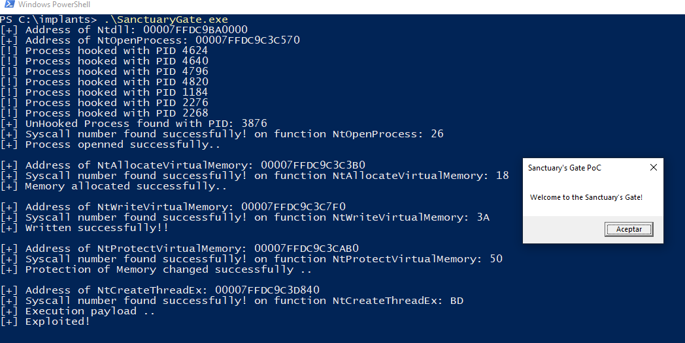

# Sanctuary's Gate


## Description
Sanctuary's Gate is a different and improved version of Hell's Gate and Tartarus Gate that allows users to bypass EDRs by obtaining the syscall numbers of remote processes.

Sanctuary's Gate operates on the premise that, for the sake of efficiency and operability, EDRs cannot hook all existing processes; otherwise, it would be highly inefficient and overload the system.

First, look for a process that does not contain the DLLs loaded by EDRs. If a single process is found without those DLLs, it means that at least the functions in ntdll.dll will not be hooked in the traditional way. 

To do this, two functions are used—OpenProcess and ReadProcessMemory—which, although they can be hooked, are utilized in a specific way focused on OPSEC to operate under the radar. This is because using OpenProcess with the PROCESS_ALL_ACCESS permission is not the same as using OpenProcess with PROCESS_VM_READ.

Once the remote process handler is obtained, its syscalls are retrieved without hooking and used in indirect system calls. 

For the indirect system calls, an intermediate register has been used to avoid static assembly signatures.  


## PoC

To create the proof of concept, I used the AES decryption function from sektor7. 

As you can see, this is a proof of concept (POC) and is not ready for use in red team exercises. To make it ready for that, further changes are necessary, such as creating a custom encryption/decryption function, ETW patching, creating custom GetModuleHandle and GetProcAddress functions, etc.

## Compilation
You can compile the .sln project as you normally would, but I strongly recommend that you compile it using cl.exe as follows (this will create a more optimized and smaller implant, giving it a better chance of evading EDRs):
```
ml64.exe /c /nologo indirectSyscall.asm && cl.exe /nologo /W0 /O1 /MD /GS- /GL /Gw /DNDEBUG /Tcmain.cpp sanctuary.c /link indirectSyscall.obj /LTCG /OPT:REF /OPT:ICF /DEBUG:NONE /OUT:SanctuaryGate.exe && del *.obj
```
## Build your payload
To create your payload, simply run the script located in payload_build/aesencrypt.py as follows, where msg.bin is your binary in raw format (for example, msfvenom -p windows/x64/exec CMD=calc.exe -f raw > calc.bin): 
```
python.exe .\aesencrypt.py calc.bin
```
Then, using the script's output, fill in the fields of your implant.

## Credits / Reference
#### Reenz0h from @SEKTOR7net (Creator of the HalosGate technique )
#### @smelly__vx & @am0nsec ( Creators/Publishers of the Hells Gate technique )
#### trickster0 (Creator of the Tartarus Gate)
- https://institute.sektor7.net/
- https://learn.microsoft.com/en-us/windows/win32/api/
- https://vxug.fakedoma.in/papers/VXUG/Exclusive/HellsGate.pdf

